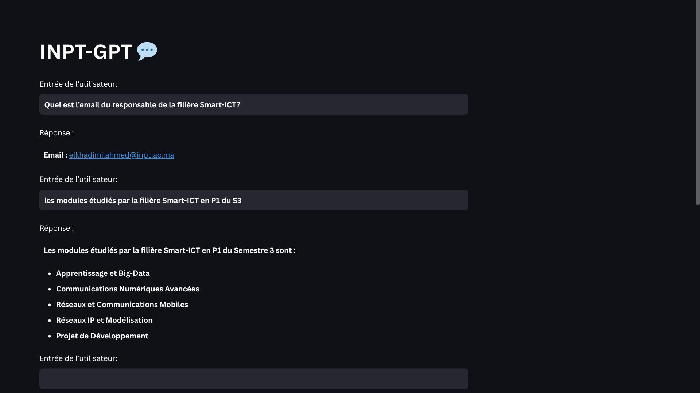

# INPT-GPT 🎓💬  
A Conversational RAG Chatbot for the Institut National des Postes et Télécommunications (INPT)

---



**INPT-GPT** is an intelligent chatbot designed to answer all questions related to INPT Rabat — including its training programs, fields of study, admission requirements, student life, and more.

Powered by Retrieval-Augmented Generation (RAG), it retrieves precise data from curated documents and provides accurate, context-aware responses using a Large Language Model (LLM).

---

## 🔍 How It Works

The system uses a classic **RAG architecture**:

### Query Processing Pipeline
When a user asks a question:


1. **Retrieve** relevant documents based on the query.
2. **Prompt** construction includes the user query + context.
3. The **LLM** answers the question based on the retrieved information.

---

### Knowledge Base Preparation

Before queries can be answered, the data must be processed and stored in a vector database:


1. **Load** documents (PDFs, websites, JSON, etc.).
2. **Split** them into smaller text chunks.
3. **Embed** each chunk using an embedding model.
4. **Store** embeddings into a vector store for fast retrieval.

---

## ⚙️ Getting Started

### 1. Clone the Repository

```bash
git clone https://github.com/manar1305/INPT-GPT-chatbot.git
cd INPT-GPT-chatbot
```

### 2. Create & Activate a Virtual Environment

```bash
# Create venv
python -m venv venv

# Activate it
# On Linux/macOS:
source venv/bin/activate
# On Windows:
venv\Scripts\activate
```

## 3. Install Dependencies

```bash
pip install -r requirements.txt
```

## 4. Set Up Environment Variables

Create a .env file at the root and add your keys (e.g. OpenAI API key, if applicable):

```ini
OPENAI_API_KEY=your_openai_key_here
```

## 5. Run the Application

You can start the chatbot via:

```bash
cd app
streamlit run app.py
```

Or another frontend script depending on your interface setup.

## 📁 Project Structure

```
rag-chatbot/
├── data/                  
│   ├── raw/               
│   │   └── sample.md      # Sample raw data
│   ├── processed/         
│   │   ├── pdfs_markdown/ # PDF content converted to markdown
│   │   │   ├── sample1.md 
│   │   │   └── sample2.md 
│   │   └── website_markdown/ # Website content converted to markdown
│   │       ├── sample1.md 
│   │       └── sample2.md 
│   ├── README.md          # Data folder documentation
│   └── webscraping.py     # Web scraping script
├── app/                   
│   └── app.py             # Streamlit application
├── src/                   
│   ├── embedding/         
│   │   └── embedding.py   # Vector database and embedding code
│   └── rag/               
│       └── query.py       # RAG query implementation
├── .env.example           # Example environment file template
├── .gitignore             
├── requirements.txt       
└── README.md              
```

## 📌 Features

✅ Answers about training programs
✅ Retrieves official INPT documents
✅ Easily extendable with new content

## 🤝 Contribute

Feel free to open issues or pull requests if you'd like to add more INPT content, improve the interface, or enhance the RAG pipeline.